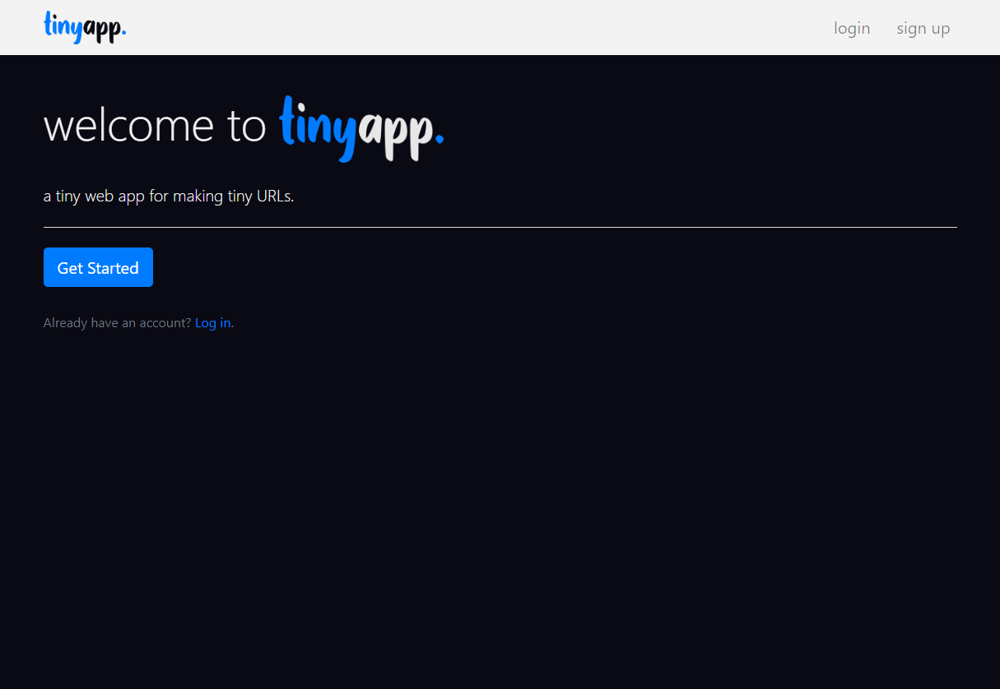
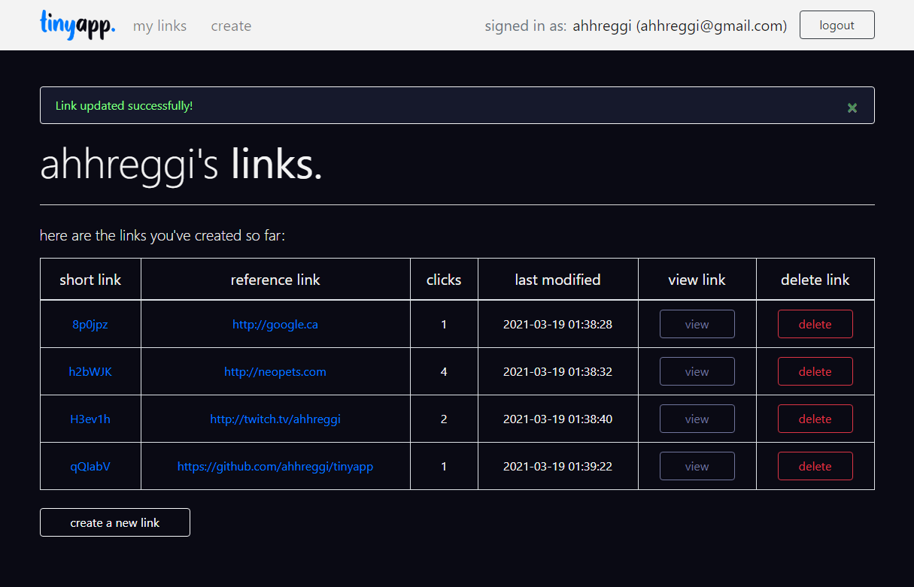

<!-- TITLE -->
<div align="center">

<p>
A tiny web app for making tiny URLs
</p>
Built with <a href="https://nodejs.org/en/">Node.js</a>, <a href="https://expressjs.com/">Express</a> and <a href="https://blog.getbootstrap.com/2018/12/21/bootstrap-4-2-1/">Bootstrap 4</a>
</div>

<!-- INTRODUCTION -->

## 📚 Introduction

<b>Tinyapp</b> is a full-stack, RESTful web application that allows users to shorten URLs (similar to [bit.ly](bit.ly)). Users may login or register an account to create and edit links, as well as view their analytics.

Built with <a href="https://nodejs.org/en/">Node.js</a>, <a href="https://expressjs.com/">Express</a> and <a href="https://blog.getbootstrap.com/2018/12/21/bootstrap-4-2-1/">Bootstrap 4</a>. Unit tested using [Mocha](https://mochajs.org/) and [Chai](https://www.chaijs.com/).

Other technologies used include [bcrypt](https://www.npmjs.com/package/bcrypt), [body-parser](https://www.npmjs.com/package/body-parser), [connect-flash](https://www.npmjs.com/package/connect-flash[), [cookie-session](https://www.npmjs.com/package/cookie-session), [dayjs](https://www.npmjs.com/package/dayjs), [EJS](https://ejs.co/), and [method-override](https://www.npmjs.com/package/method-override).

<!-- FEATURES -->

## ⭐ Features

- Create, modify, and delete generated URLs
- View analytics (total clicks, unique clicks)
- User authentication and authorization

<!-- INSTALLATION -->

## 🛠 Installation

1. Clone or download this repository
   ```
   git clone https://github.com/ahhreggi/tinyapp
   ```
2. Navigate to the project directory and install dependencies
   ```
   cd tinyapp
   npm install
   ```
3. Launch the development web server
   ```
   node app.js
   ```
4. Visit <a href="http://localhost:8080/">http://localhost:8080/</a> on your browser

## ✔️ Testing

1. Run Mocha & Chai tests
   ```
   npm test
   ```

## 📷 Screenshots







