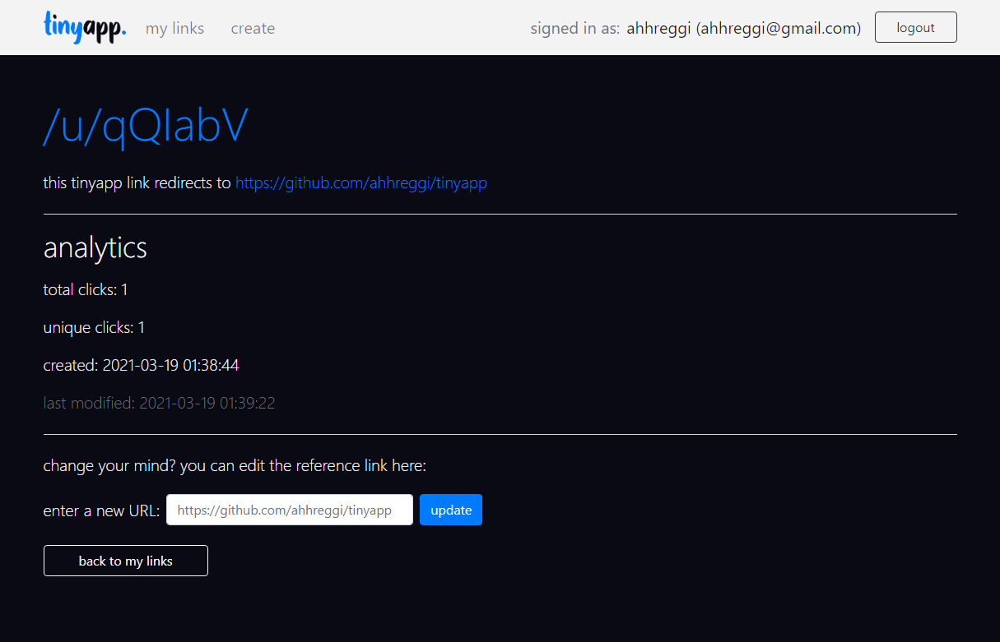

<!-- TITLE -->
<div align="center">

<p>
A tiny web app for making tiny URLs
</p>
<b>Built with <a href="https://nodejs.org/en/">Node.js</a>, <a href="https://expressjs.com/">Express</a> and <a href="https://blog.getbootstrap.com/2018/12/21/bootstrap-4-2-1/">Bootstrap 4</a></b>
</div>

<!-- INTRODUCTION -->

## 📚 Introduction

<b>tinyapp.</b> is a full-stack, RESTful web application that allows users to shorten URLs (similar to bit.ly). Users may login or register an account to create and edit links, as well as view their analytics.

<!-- FEATURES -->

## ⭐ Features

- Create, modify, and delete generated URLs
- View analytics (total clicks, unique clicks)
- Client- and server-side user authentication and authorization

<!-- INSTALLATION -->

## 🛠 Installation

1. Clone or download this repository
   ```
   git clone https://github.com/ahhreggi/tinyapp
   ```
2. In the project directory, install dependencies
   ```
   npm install
   ```
3. Launch the development web server
   ```
   node express_server.js
   ```
4. Visit <a href="http://localhost:8080/">http://localhost:8080/</a> on your browser

## 📷 Screenshots



